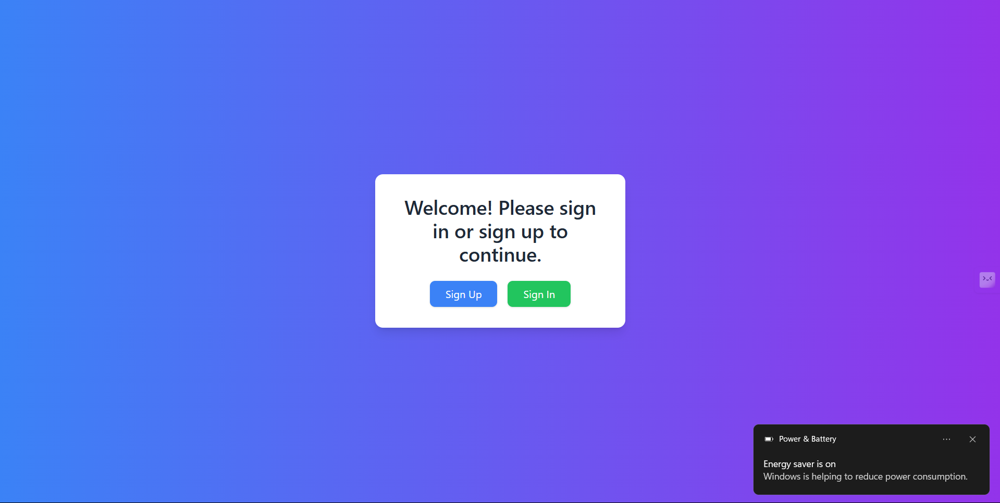
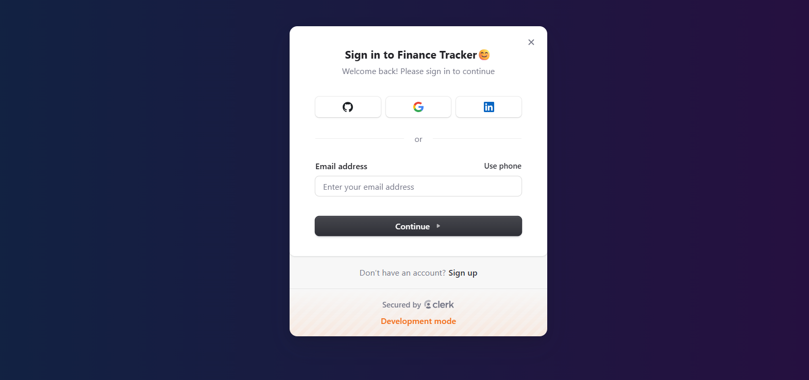
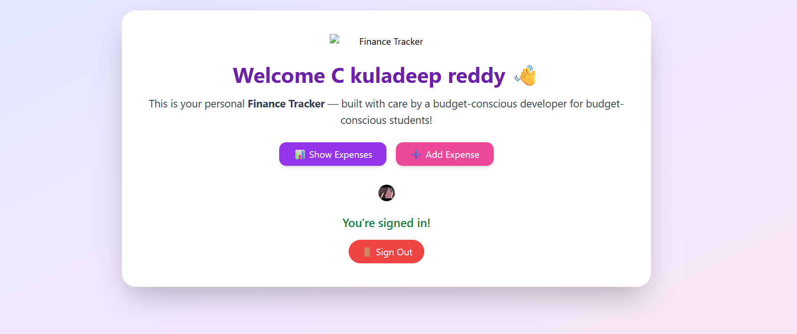
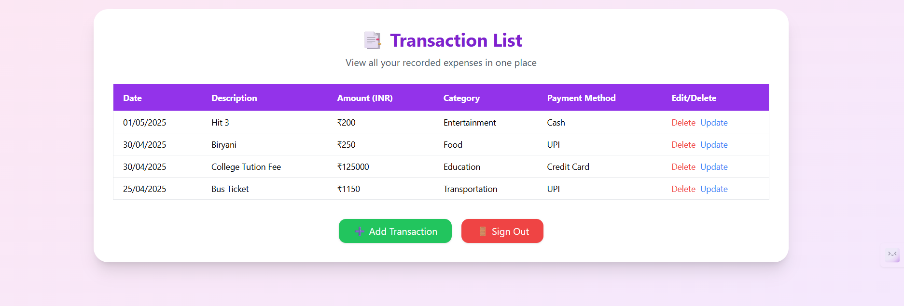
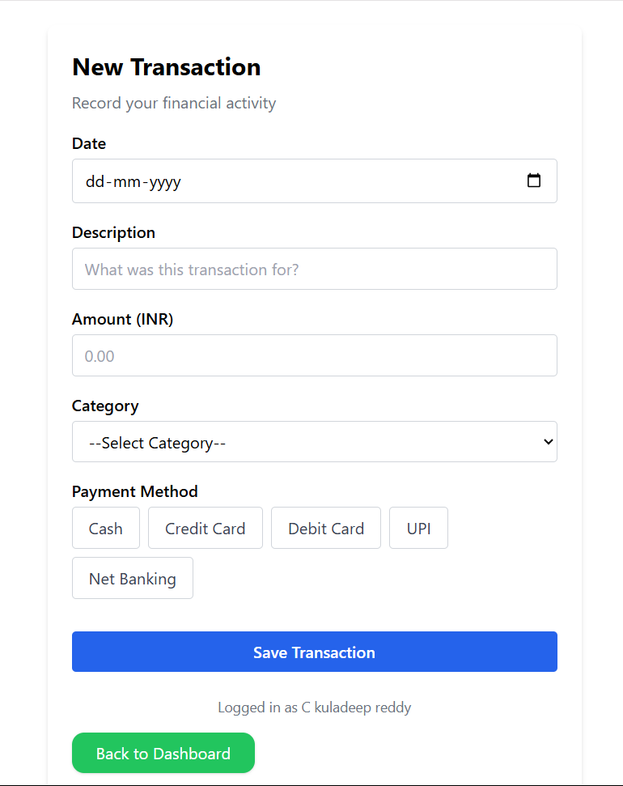

# 💰 Finance Tracker

  
  
  

# 💰 Finance Tracker

**Track your income and expenses with ease!**  
A full-stack Finance Tracker built using the **MERN stack**, featuring secure authentication powered by **Clerk**.

🔗 **Live Demo:** [Finance Tracker on Render](https://finance-tracker-with-authentication-4.onrender.com)

---

## 🛠️ Features

- 🔐 **Authentication with Clerk** (Sign-up, Login, Logout)
- 🧾 **CRUD operations** for transactions (Add, View, Update, Delete)
- 📊 **Visual tracking** of your finances (income vs. expense)
- 🌐 **Responsive UI** built with ReactJS & styled using Tailwind CSS
- 💾 **Persistent data** storage with MongoDB
- ⚙️ **Robust backend** with Node.js and Express

---

## 🧑‍💻 Technologies Used

### Frontend:
- ReactJS ⚛️  
- Tailwind CSS 🎨  
- Axios 🔄  
- Clerk (for authentication) 🔐  

### Backend:
- Node.js 🟢  
- Express.js 🚀  
- MongoDB + Mongoose 🍃  

---

## 🔒 Authentication

Authentication is securely handled via [Clerk](https://clerk.dev), enabling:
- Secure user registration and login
- Session management
- User data isolation

---

## 🔄 CRUD Functionalities

- **Create:** Add new income or expense entries  
- **Read:** View detailed financial records  
- **Update:** Edit existing transactions  
- **Delete:** Remove outdated or incorrect records  

---

## 📂 Project Structure
finance-tracker/
├── frontend/ # React frontend
│ └── pages/
├── backend/ # Node.js backend
│ ├── models/
│ ├── routes/
└── README.md

📸 Screenshots
Here are some previews of the app in action:

## 🚀 Deployment

The app is **deployed using [Render](https://render.com/)** and is accessible at:  
👉 [https://finance-tracker-with-authentication-4.onrender.com](https://finance-tracker-with-authentication-4.onrender.com)

---

## 📈 Future Enhancements

- 📅 Monthly summaries and spending trends  
- 🥧 Pie chart for category-wise analysis  
- 📄 Downloadable reports (PDF/Excel)  
- 🌙 Dark mode toggle  

---

## 📬 Contact

Developed with ❤️ by **Kuladeep Reddy Chappidi**  
For feedback or inquiries, feel free to reach out!

---
For queries or feedback, feel free to reach out!

